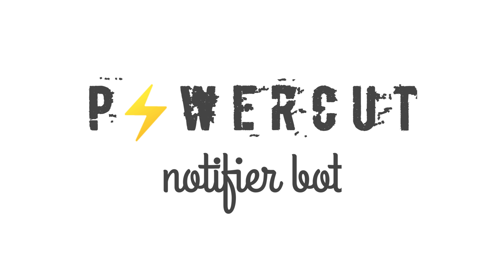

# powercut_bot ⚡

 <p align="center">
 
 </p>

 
 Power Cut Scheduler. This is a telegram bot which developed in `python` language. The purpose of the bot is helps to send notification of the power interrupt time before an hour via `telegram`. 

 ## Bot link

 <a href="https://PowerCut_NotifierBot.t.me/">@PowerCut_NotifierBot</a>

 ## Token 

 In the root directory of the project 
  1. Create a new `.env` file
  2. Add the blow code with your `TOKEN`

 ```.env
    TOKEN = TOKEN_OF_YOUR_THE_BOT
```

## Install required python packages

```bash
pip install -r requirements.txt
```


*****

### To run virtual environment on VSCode


```bash
# macOS/Linux
# You may need to run sudo apt-get install python3-venv first
python3 -m venv .venv

# Windows
# You can also use py -3 -m venv .venv
python -m venv .venv
```

### On VSCode

1. `ctrl` + `shift` + `p` and select Python Interpreter
2. Select the `enter interpreter path`
3. Browse and select `.venv/Scripts/python.exe`


If you want to manually specify a default interpreter that will be used once you first open your workspace, you can create or modify an entry for `python.defaultInterpreterPath` setting in your workspace `settings.json` with the full path to the Python executable. 

In `settings.json`

```json
{
  "python.defaultInterpreterPath": "YOUR_PATH/.venv/Scripts/python.exe"
}

```

## Scan to chat with PowerCutBot 
<br/>
<a href="https://powercut_notifierbot.t.me/">
  
</a>

## Enjoy 🥳🥳